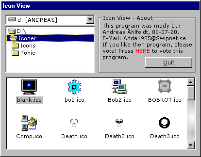



## Icon Viewer

### Description

Select a directory and the program will show all icons in the selected directory, in one list.

Cool, please vote.
 
### More Info
 

             |
---                |---
**Submitted On**   |2000-07-20 23:58:08
**By**             |[Andreas Åhlfeldt](https://github.com/Planet-Source-Code/PSCIndex/blob/master/ByAuthor/andreas-hlfeldt.md)
**Level**          |Intermediate
**User Rating**    |3.8 (19 globes from 5 users)
**Compatibility**  |VB 3\.0, VB 4\.0 \(16\-bit\), VB 4\.0 \(32\-bit\), VB 5\.0, VB 6\.0, VB Script, ASP \(Active Server Pages\) 
**Category**       |[Complete Applications](https://github.com/Planet-Source-Code/PSCIndex/blob/master/ByCategory/complete-applications__1-27.md)
**World**          |[Visual Basic](https://github.com/Planet-Source-Code/PSCIndex/blob/master/ByWorld/visual-basic.md)
**Archive File**   |[CODE\_UPLOAD79817202000\.zip](https://github.com/Planet-Source-Code/andreas-hlfeldt-icon-viewer__1-9929/archive/master.zip)

